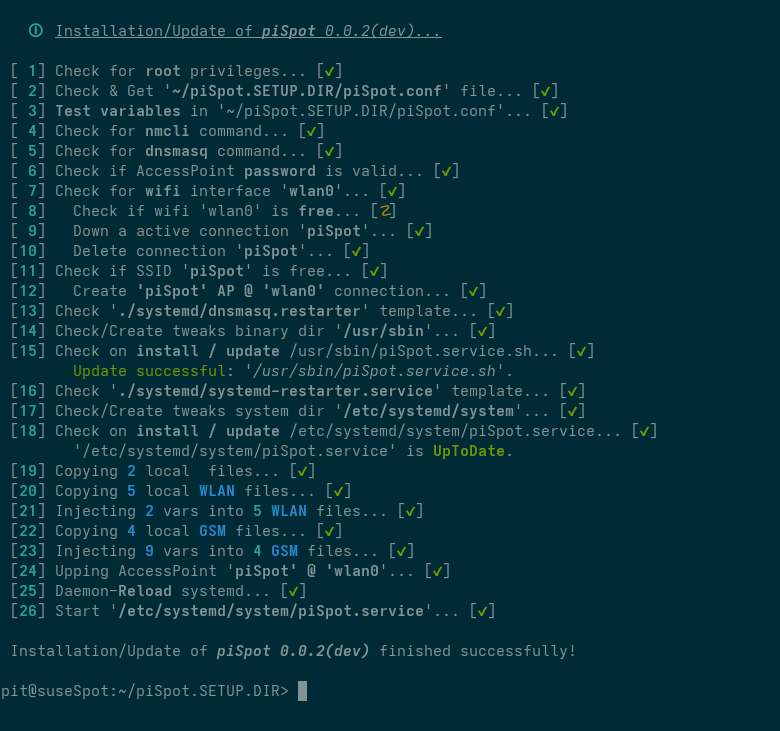

# piSpot
### Collection of comfortable bash scripts to setup and manage a minimized mobile AccessPoint for RaspberryPi like Hardware.

- **Ethernet, WLAN, GSM** as iNet sources.
- **AdBlock, ChildProtection, AnonymousDNS**.
- **~~VPN, Tor~~** as optional 'sources'. *(ongoing)*
- **NetworkManager, dnsmasq,** systemd **,sudo** are the only dependencies.
- **WIFI, Ethernet** as iNet destinations.

**~~DO NOT USE - ONGOING DEVELOPMENT - !! pre Alpha State !!~~**  
**!! Still ONGOING DEVELOPMENT !! - but 1st usable version is there.**  
 

### How to install - without knowing how it's exactly functioning...

1. Open a terminal - go to your home directory. *Or somewhere else where you can deal with it, that the following script will create a folder at the destination where the script is called!* 
2. Run `wget -q -O GetNextSetup.sh https://raw.githubusercontent.com/PitWD/piSpot/refs/heads/main/GetNextSetup.sh` will get you the 'download script'.
3. Run `bash ./GetNextSetup.sh` will download all setup files into the (new created) folder `./piSpot.SETUP.DIR`.
4. Switch to the setup folder: `cd piSpot.SETUP.DIR`.
5. Run `sudo bash Install.sh` will setup **piSpot**, depending on the settings (see the `piSpot.conf` file).  
Without individual config settings the `Install.sh` script will just ask for the password to access **piSpot**.

    - **piSpot** will get saved (and started) as a **NetworkManager AP** connection on `wlan0 (10.0.1.254)`.
    - Clients get **IPv4** addresses in the range from `10.0.1.20` to `10.0.1.200` at `255.255.255.0`
    - **IPv6** is automatically managed by **dnsmasq**.
    - **DNS** upstream servers are taken from **DNS4EU** *(Protective + AdBlock)*.  
    *See `piSpot.conf` for some other templates (e.g. additional ChildProtection) or full individual settings*.  
    - For **Ethernet** as iNet source you just need:
      - to connect your RaspberryPi to ethernet.
    - For **WLAN** as iNet source you need:
        - A secondary wlan adapter at `wlan1`.  
        - Run `sudo piSpot_wlan_new.sh` and follow the instructions to add and save a new connection.
    - For **GSM** as iNet source you need:
        - A (USB) GSM / WWAN adapter at `*`. *(the 1st gets selected)*  
        - Run `sudo piSpot_gsm_new.sh` and follow the instructions to add and save the connection.  

    While using the default settings a tweak gets installed which injects individual settings into the dnsmasq-service which got started by NetworkManagers AP Mode. The AccessPoint will function without the tweak, but then it's i.e. impossible to set individual DNS servers to get the simplest way for AdBlock, ChildProtection and AnonymousDNS. *As many other options, you can disable the tweak in the `piSpot.conf` file*. **Whenever you're changing settings, you have to run `Install.sh` again to get the changes activated.**

 

    

### Known issues...

0. !! YOU ARE USING A "**PreAlpha**" VERSION !!
1. Missing uninstall script.
2. Missing auto recognition if **GSM** needs a **PIN**, dial number, user or password. *See the `piSpot.conf` file to adjust the needs of your **SIM** card to get a connection up*.
3. Actually there are already much **more scripts** installed to handle **WLAN** and **GSM** connections - but without any explanation or mentioning here.
4. Missing **TUI** which handles all the scripts to manage all piSpot scripts.
5. Parallel **WLAN** and **GSM** connection as iNet sources may exclude you from accessing the piSpot on all interfaces. *Just unplug the WLAN or GSM stick and you're back in game*.
6. The reboot resistant **tweak** depends actually on **systemd**. *But there is already a manual way to do it without systemd - see the (undocumented) scripts...*
7. DO NOT USE **nmtui** - even just watching the piSpot connection there will kill the functionality - *actually no clue why...*
8. **OpenSuse** (ARM for RasPi) tumbleweed minimal.
    - **missing** dnsmasq, mmcli, udhcpc
    - messed up hard-paths for **route** in */usr/share/udhcpc/default.bond*
9. NetworkManager incompatible **GSM** sticks may now work via ModemManager - but such hardware will actually not autoconnect after reboot or reconnection!
But after one time `sudo piSpot_wwan_new.sh` you can then do `sudo piSpot_wwan_up.sh` to reconnect after reboot or reconnection. *(Yes, at least the "up" script should work without sudo... and it will... soon!)*
